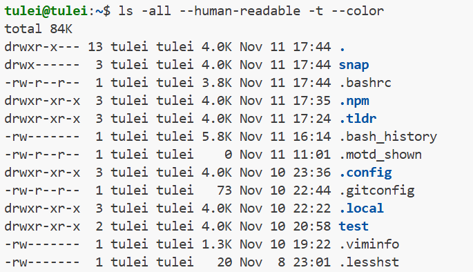
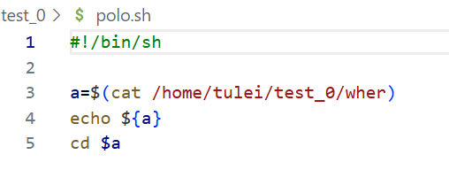
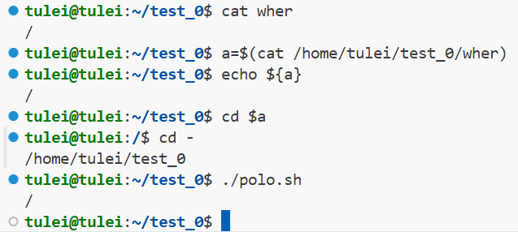
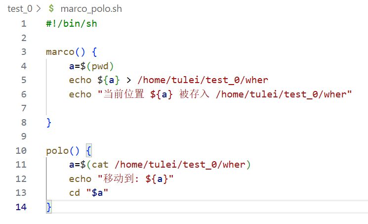
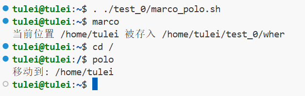
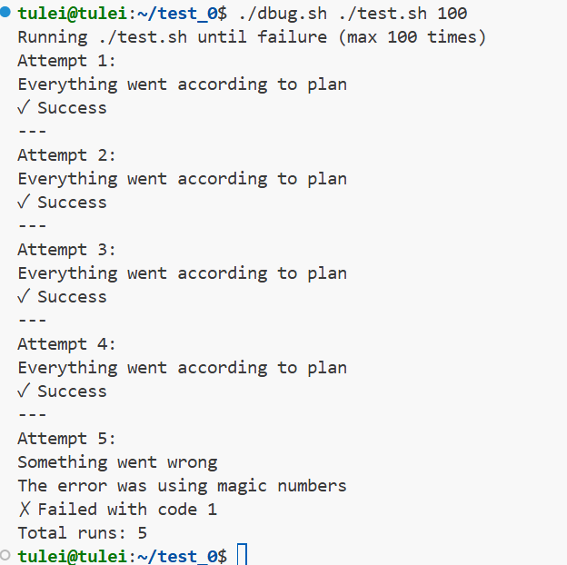
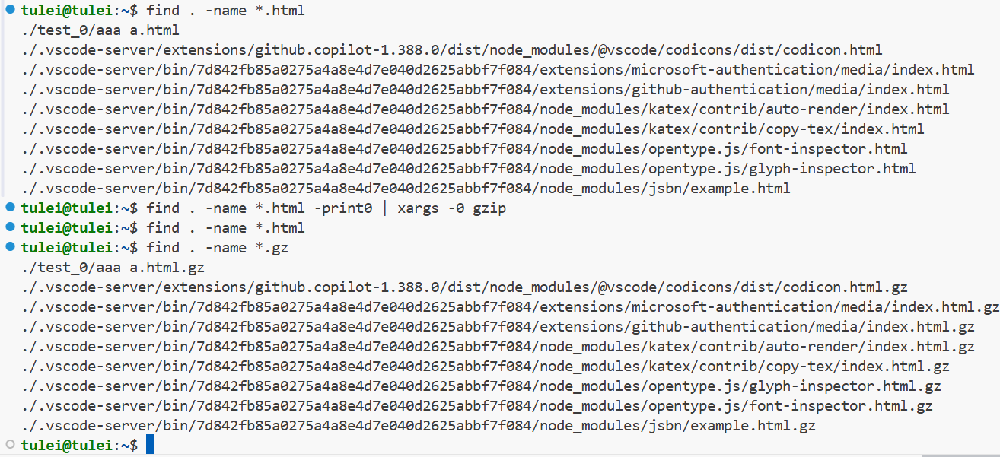
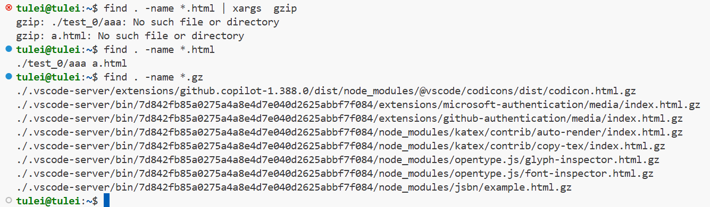
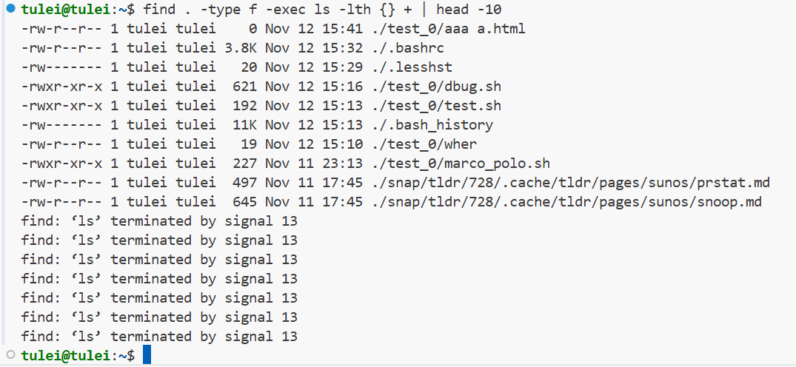

[Shellscript教程](https://www.shellscript.sh/)
[菜鸟教程](https://www.runoob.com/linux/linux-shell.html)
[文档](https://www.gnu.org/savannah-checkouts/gnu/bash/manual/bash.html#Introduction)
[30分钟教程](https://linuxhint.com/30_bash_script_examples/)


## 什么是bash？

我们通常所说的bash和shell script之间的关系可以这样理解：

1. shell是一个统称，它是一种命令行解释器，提供了用户与操作系统内核交互的界面。
2. bash（Bourne-Again SHell）是shell的一种，是许多Linux发行版和macOS（在较新版本中已改为zsh，但bash仍常见）默认的shell。
3. shell script（shell脚本）是一种为shell编写的脚本程序，它可以用各种shell的解释器来执行，包括bash、sh、zsh等。

脚本的第一行通常会是 `#!/bin/bash`（称为 Shebang），这指明了这个脚本必须用Bash来解释执行。如果写的是 `#!/bin/sh`，则可能被链接到更精简的Shell（如`dash`）来执行。

---

## Hello World

Shell脚本一般以 **.sh** 作为文件的后缀名

```bash
#!/bin/bash
echo "hello World"
```

```#!``` 是一个约定标记，告诉系统这个解释器用什么脚本来运行

注意，在尝试运行你所写的shell脚本是，command一定要写成 **./hello.sh**，而不是 **hello.sh**，运行其它二进制的程序也一样，直接写 test.sh，linux 系统会去 PATH 里寻找有没有叫 test.sh 的，而只有 /bin, /sbin, /usr/bin，/usr/sbin 等在 PATH 里，你的当前目录通常不在 PATH 里，所以写成 test.sh 是会找不到命令的，要用 ./test.sh 告诉系统说，就在当前目录找。

```Shell
tulei@tulei:~/test$ ls
hello.sh  hello_1.txt
tulei@tulei:~/test$ ls -l
total 8
-rw-r--r-- 1 tulei tulei 31 Nov  9 13:43 hello.sh
-rw-r--r-- 1 tulei tulei  6 Nov  8 23:30 hello_1.txt

# 使sh可以执行，是因为，sh这个程序在/bin文件内，而他只是把后边程序的内容作为参数输入
tulei@tulei:~/test$ sh hello.sh
Hello,World

# 直接运行 hello.sh，会导致找不到程序，即使为他赋予执行权限依旧无法执行
tulei@tulei:~/test$ hello.sh
hello.sh: command not found
tulei@tulei:~/test$ chmod +x hello.sh
tulei@tulei:~/test$ ls -l
total 8
-rwxr-xr-x 1 tulei tulei 31 Nov  9 13:43 hello.sh
-rw-r--r-- 1 tulei tulei  6 Nov  8 23:30 hello_1.txt
tulei@tulei:~/test$ hello.sh
hello.sh: command not found

# 需要使用相对路径来告诉计算机这个程序在哪
tulei@tulei:~/test$ ./hello.sh
Hello,World

# 删掉执行权限，哪怕可以定位，但也是无法执行的
tulei@tulei:~/test$ chmod -x hello.sh
tulei@tulei:~/test$ ls -l
total 8
-rw-r--r-- 1 tulei tulei 31 Nov  9 13:43 hello.sh
-rw-r--r-- 1 tulei tulei  6 Nov  8 23:30 hello_1.txt
tulei@tulei:~/test$ ./hello.sh
bash: ./hello.sh: Permission denied
tulei@tulei:~/test$ 
```

---

## Shell 变量

### 命名变量

一定记得变量名和等号之间**不能**有空格

```bash
# 变量命名不能有空格
tulei@tulei:~/test$ foo=bar
tulei@tulei:~/test$ echo $foo
bar

# 有命名时会报错
tulei@tulei:~/test$  foo = bar
Command 'foo' not found, did you mean:
  command 'roo' from snap roo (2.0.3)
  command 'goo' from deb goo (0.155+ds-4)
  command 'fox' from deb objcryst-fox (1.9.6.0-2.2)
  command 'fio' from deb fio (3.28-1)
  command 'foot' from deb foot (1.11.0-2)
  command 'fop' from deb fop (1:2.6-2)
See 'snap info <snapname>' for additional versions.
```

同时，变量名的命名须遵循如下规则：

- **只包含字母、数字和下划线：** 变量名可以包含字母（大小写敏感）、数字和下划线 _，不能包含其他特殊字符。
- **不能以数字开头：** 变量名不能以数字开头，但可以包含数字。
- **避免使用 Shell 关键字：** 不要使用Shell的关键字（例如 if、then、else、fi、for、while 等）作为变量名，以免引起混淆。
- **使用大写字母表示常量：** 习惯上，常量的变量名通常使用大写字母，例如 PI=3.14。
- **避免使用特殊符号：** 尽量避免在变量名中使用特殊符号，因为它们可能与 Shell 的语法产生冲突。
- **避免使用空格：** 变量名中不应该包含空格，因为空格通常用于分隔命令和参数。

使用一个定义过的变量，只要在变量名前面加**美元符号**即可，如：

```bash
your_name="qinjx"  
echo $your_name  
echo ${your_name}  
```

**单引号和双引号**有时会不一样：

```bash
tulei@tulei:~/test$ echo "Value is $foo"
Value is bar
tulei@tulei:~/test$ echo 'Vlaue is $foo'
Vlaue is $foo
```

**变量使用时最好加上{}**

变量名外面的**花括号**是可选的，加不加都行，加花括号是为了帮助解释器识别变量的边界，比如下面这种情况：

```bash
for skill in Ada Coffe Action Java; do  
    echo "I am good at ${skill}Script"  
done  
```

如果不给skill变量加花括号，写成```
``` 
echo "I am good at $skillScript" 
```
 ，解释器就会把$skillScript当成一个变量（其值为空），代码执行结果就不是我们期望的样子了。

推荐给所有变量加上花括号，这是个好的编程习惯。

---
### $ 符号的使用(参数的获取)

在开始之前，先把本节中可能用到的知识放在这里
 
-  $1代表输入的第一个参数
-  $? 返回上次命令是否成功
-  $_ 获取上次命令最后一个参数
- `!!` 会替代掉你上次想要执行，但未能成功执行的命令$
-  $0 是运行的脚本的文件名
-  $# 代表给定参数的个数
- `$$` 代表这个命令进程的ID
-  $@ 代表所有参数

**$1代表输入的第一个参数：**

```shell
cmd () {
    mkdir -p "$1"
    cd "$1"
}
```

之后，使用 `source` 即可让解释器知道我们所定义的函数

```bash
tulei@tulei:~/test$ source hello.sh 
tulei@tulei:~/test$ cmd test_1
tulei@tulei:~/test/test_1$ 
```

这里的 `$1` 代表函数接收到的第一个参数，实际上从 `$1` 到 `$9` 都是允许的

**`$?` 返回上条错误的代码**

返回0代表一切正常，没有错误

```bash
tulei@tulei:~/test$ echo "hello"
hello
tulei@tulei:~/test$ $?
0: command not found$
```

返回了上次的报错

```
tulei@tulei:~/test$ ls
# grep 表示在收到的第二个参数的文件里，寻找第一个参数
tulei@tulei:~/test$ grep hello hello.txt
grep: hello.txt: No such file or directory
tulei@tulei:~/test$ $?
2: command not found
```

实际上可以进行**逻辑运算**

The `true` program will always have a 0 return code and the `false` command will always have a 1 return code

```bash
tulei@tulei:~/test$ false
tulei@tulei:~/test$ $?
1: command not found

tulei@tulei:~/test$ false || echo "hello"
hello
tulei@tulei:~/test$ $?
0: command not found

# 或运算：第一个运行失败了第二个才会执行
tulei@tulei:~/test$ true || echo "hello"
tulei@tulei:~/test$ $?
0: command not found
tulei@tulei:~/test$

# 与运算：第一个只要失败，第二个就不会执行
 tulei@tulei:~/test$ false && echo "hello"
tulei@tulei:~/test$ $?
1: command not found
tulei@tulei:~/test$ true && echo "hello"
hello
tulei@tulei:~/test$ $?
0: command not found
tulei@tulei:~/test$ 
```

在同一命令中使用分号连接，那么不论怎样，都会依次输出

```bash
tulei@tulei:~/test$ false ; echo "hello"
hello
tulei@tulei:~/test$ $?
0: command not found
```

 **`$_` 获取上条命令的最后一个参数**

```bash
tulei@tulei:~$ ls
tulei@tulei:~$ mkdir test
tulei@tulei:~$ cd $_
tulei@tulei:~/test$ 
```

把参数赋值给变量后再使用

```bash
tulei@tulei:~/test$ foo=$(pwd)
tulei@tulei:~/test$ echo foo
foo
tulei@tulei:~/test$ echo $foo
/home/tulei/test
tulei@tulei:~/test$ echo ${foo}
/home/tulei/test
```

可以不把参数赋值给变量而直接使用

```bash
tulei@tulei:~/test$ echo "we are in $(pwd)"
we are in /home/tulei/test
tulei@tulei:~/test$ 
```

**案例**：记得去回顾以下$后加不同符号，代表什么

**在bash中执行比较时，尽量使用双括号[[ ]]而不是简单括号[ ]。以降低出错的概率**

```shell
#!/bin/bash

echo "Starting program at $(date)"

echo "Running program $0 with $# arguments with pid $$"
  
for file in "$@"; do
    #将得到的输出全部丢弃（被放在dev这个文件夹下的信息都会被丢弃）
    grep foobar "$file" > /dev/null 2> /dev/null  
    #如果找到了，$?就是0，没找到就不是0
    if [[ "$?" -ne 0 ]]; then
        echo "File $file doed not have any foobar"
        echo "# foobar" >> "$file"
    fi
done
```

运行结果如下：

```bash
tulei@tulei:~/test$ ./example.sh example.sh aaa.md 
Starting program at Mon Nov 10 20:41:15 CST 2025
Running program ./example.sh with 2 arguments with pid 36453
File aaa.md doed not have any foobar
```

aaa.md没有“foobar”这个词组，就为他后边添加了"# foobar"这个词组

---
### 通配符globbing

从上边的例子我们发现，实际上如果每次输入时都需要完整输入所有参数，是有点丑陋的，所以，我们介绍通配符，他允许批量确定参数

- `？`用于替代 **一个** 你不是很清楚的字符
- `*` 用于替代你不知道的 **任意多个** 字符
- `{}` 用于在给定的几个可选项里寻找

你可以把`*`理解为一个万能的替换符号，不论什么不知道时，都可以用它换掉

```bash
tulei@tulei:~/test$ ls
aaa.md  example.sh  example_1.sh
tulei@tulei:~/test$ ls *.sh
example.sh  example_1.sh
```

`*` 与`?` 的差别：

```bash
# 都可以进行快速查找
tulei@tulei:~$ find tes*
test
test/example.sh
test/example_1.sh
test/aaa.md
tulei@tulei:~$ find tes?
test
test/example.sh
test/example_1.sh
test/aaa.md

# 但 ？表示不知道的一个字符，而*可以是任意多个
tulei@tulei:~$ find t?
find: ‘t?’: No such file or directory
tulei@tulei:~$ find t*
test
test/example.sh
test/example_1.sh
test/aaa.md
tulei@tulei:~$ 
```

`{}` 的使用：

```bash
convert image.{png,jpg}
# Will expand to
convert image.png image.jpg
```

---
## 与其他语言结合

Note that scripts need not necessarily be written in bash to be called from the terminal. For instance, here’s a simple Python script that outputs its arguments in reversed order:

```bash
#!/usr/local/bin/python
import sys
for arg in reversed(sys.argv[1:]):
    print(arg)
```

The kernel knows to execute this script with a python interpreter instead of a shell command because we included a [shebang](https://en.wikipedia.org/wiki/Shebang_\(Unix\)) line at the top of the script. It is good practice to write shebang lines using the [`env`](https://www.man7.org/linux/man-pages/man1/env.1.html) command that will resolve to wherever the command lives in the system, increasing the portability of your scripts. To resolve the location, `env` will make use of the `PATH` environment variable we introduced in the first lecture. For this example the shebang line would look like `#!/usr/bin/env python`.

Some differences between shell functions and scripts that you should keep in mind are:

- Functions have to be in the same language as the shell, while scripts can be written in any language. This is why including a shebang for scripts is important.
- Functions are loaded once when their definition is read. Scripts are loaded every time they are executed. This makes functions slightly faster to load, but whenever you change them you will have to reload their definition.
- Functions are executed in the current shell environment whereas scripts execute in their own process. Thus, functions can modify environment variables, e.g. change your current directory, whereas scripts can’t. Environment variables which have been exported using [`export`](https://www.man7.org/linux/man-pages/man1/export.1p.html) are passed by value to scripts.
- As with any programming language, functions are a powerful construct to achieve modularity, code reuse, and clarity of shell code. Often shell scripts will include their own function definitions.

---
## Exercises

### Exercise 1

Read [`man ls`](https://www.man7.org/linux/man-pages/man1/ls.1.html) and write an `ls` command that lists files in the following manner

- Includes all files, including hidden files
- Sizes are listed in human readable format (e.g. 454M instead of 454279954)
- Files are ordered by recency
- Output is colorized

A sample output would look like this

```bash
 -rw-r--r--   1 user group 1.1M Jan 14 09:53 baz
 drwxr-xr-x   5 user group  160 Jan 14 09:53 .
 -rw-r--r--   1 user group  514 Jan 14 06:42 bar
 -rw-r--r--   1 user group 106M Jan 13 12:12 foo
 drwx------+ 47 user group 1.5K Jan 12 18:08 ..
```



### Exercise 2

Write bash functions `marco` and `polo` that do the following. Whenever you execute `marco` the current working directory should be saved in some manner, then when you execute `polo`, no matter what directory you are in, `polo` should `cd` you back to the directory where you executed `marco`. For ease of debugging you can write the code in a file `marco.sh` and (re)load the definitions to your shell by executing `source marco.sh`.

这里在给出正确答案之前先给一种错解：

我写了以下 .sh 脚本，尽管分条在命令行中执行每一条命令可以达到移动位置的效果，但直接运行脚本并不能完成转换：



分别执行：



这里错误是因为：  ==当你在命令行中逐行执行时，cd命令会改变当前shell的目录。但是，当你运行脚本时，脚本是在一个子shell中执行的，cd命令只会改变子shell的当前目录，而不会影响父shell（即你当前的终端）。因此，脚本执行完毕后，子shell结束，你回到父shell，目录自然没有改变。==

解决方案：使用`source` 或 `.` 在当前shell中加载函数，之后在当前shell中执行即可

正解：



函数运行演示：



### Exercise 3

- Say you have a command that fails rarely. In order to debug it you need to capture its output but it can be time consuming to get a failure run. Write a bash script that runs the following script until it fails and captures its standard output and error streams to files and prints everything at the end. Bonus points if you can also report how many runs it took for the script to fail.

```bash
 #!/usr/bin/env bash

 n=$(( RANDOM % 100 ))

 if [[ n -eq 42 ]]; then
	echo "Something went wrong"
>&2 echo "The error was using magic numbers"
	exit 1
 fi

 echo "Everything went according to plan"
```

脚本代码：

```bash
#!/bin/bash 

name=$1
declare -i step
step=$2

echo "Running ${name} until failure (max ${step} times)"

arr=()
i=0

while [[ $i -lt $step ]]; do
    echo "Attempt $((i+1)):"
    # 运行脚本
    if ./"$name"; then
        arr[i]=0
        echo "✓ Success"
    else
        arr[i]=$?
        echo "✗ Failed with code ${arr[i]}"
        break
    fi
    ((i++))
    echo "---"
done
  
echo "Total runs: ${#arr[@]}"
```

运行效果：


### Exercise 4

As we covered in the lecture `find`’s `-exec` can be very powerful for performing operations over the files we are searching for. However, what if we want to do something with **all** the files, like creating a zip file? As you have seen so far commands will take input from both arguments and STDIN. When piping commands, we are connecting STDOUT to STDIN, but some commands like `tar` take inputs from arguments. To bridge this disconnect there’s the [`xargs`](https://www.man7.org/linux/man-pages/man1/xargs.1.html) command which will execute a command using STDIN as arguments. For example `ls | xargs rm` will delete the files in the current directory.

Your task is to write a command that recursively finds all HTML files in the folder and makes a zip with them. Note that your command should work even if the files have spaces (hint: check `-d` flag for `xargs`).

If you’re on macOS, note that the default BSD `find` is different from the one included in [GNU coreutils](https://en.wikipedia.org/wiki/List_of_GNU_Core_Utilities_commands). You can use `-print0` on `find` and the `-0` flag on `xargs`. As a macOS user, you should be aware that command-line utilities shipped with macOS may differ from the GNU counterparts; you can install the GNU versions if you like by [using brew](https://formulae.brew.sh/formula/coreutils).



在通道 | 前的 ```-print0``` 表示：将找到的所有路径，以null作为分隔，然后输出
在通道 | 后的 ```-0``` 表示：以null作为分隔，将输入划分后给后边的脚本


第一个报错：
- 这是因为 `find`命令使用了 `-print0`，它会用空字符（NUL）分隔找到的文件名，但是 `xargs`默认使用空白字符（空格、换行等）作为分隔符。所以当文件名中包含空格时，就会出错。

第二个报错：
- `find`命令没有使用 `-print0`，所以输出是用换行分隔的，但是 `xargs`使用了 `-0`选项，表示期望用空字符分隔输入。这样不匹配，导致 `xargs`将整个文件列表当作一个文件名处理，因为中间有空格，所以被拆成了多个不存在的文件。
-  另外，您可能已经注意到，第二个命令中，`xargs -0`期望的是以空字符分隔的输入，但是 `find`默认使用换行分隔，所以不匹配。

为什么要使用空字符（NUL）分隔，而不用默认的分隔呢？
- 默认分隔无法识别文件名中的空格，如下图中的 “aaa  a.html”



### Exercise 5

-  (Advanced) Write a command or script to recursively find the most recently modified file in a directory. More generally, can you list all files by recency?

```bash
find . -type f -exec ls -lth {} + | head -10
```

```find . type f ```：递归查找当前目录下所有文件
```-exec ls -lth``` : 将找到的文件用 ls 排列，-lth 表示，详细，按时间顺序，人类可读
```{} ``` ：是占位符号，这里是将 find . type f 找到的文件填入
```+```：表示占位符中有很多内容，需要一次性扔给 ls 执行
```head -10```：列出前10个


