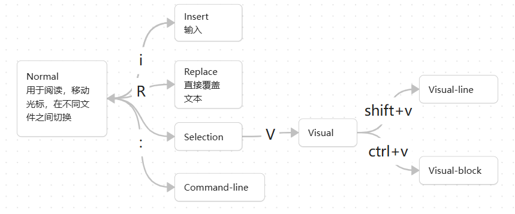

Vim的快捷键： https://devhints.io/vim
Vim 四周教程：[https://medium.com/actualize-network/how-to-learn-vim-a-four-week-plan-cd8b376a9b85](https://medium.com/actualize-network/how-to-learn-vim-a-four-week-plan-cd8b376a9b85)
Vim技巧：[http://yannesposito.com/Scratch/en/blog/Learn-Vim-Progressively/](http://yannesposito.com/Scratch/en/blog/Learn-Vim-Progressively/)

## Vim 基本操作介绍：

Vim 是基于 model 的编辑器，他有以下几种模式，使用 esc 即可返回 normal. 



因为我们需要经常返回Normal模式，而```esc``` 键又举例手指太远，所以推荐使用imap将esc映射为键盘上比较方便的按键，具体教程如下：[alternative mapping](https://vim.fandom.com/wiki/Avoid_the_escape_key#Mappings)

- **打开**：在shell界面，按下 vim + 文件名，即可打开vim编辑器
- **退出**：不断按 esc 直到退回到normal模式，之后按 : 进入command-line，按下wq，即可退出

好的，你已经学会打开与关闭了，请自己去下边提供的资源练一练吧。

下边介绍一个totorial 和一个游戏，你可能会用到

- `vimtutor` is a tutorial that comes installed with Vim - if Vim is installed, you should be able to run `vimtutor` from your shell
- [Vim Adventures](https://vim-adventures.com/) is a game to learn Vim

为以后复习用，把vimtutor每一章后边的总结放在下边，但还是推荐没有去试过的读者自己去练习以下，跟着敲一敲实际上也就熟悉了

You should be learning by doing, not memorization.

如果想要快速熟练的话，推荐将你所有的编辑器都装上Vim插件（我相信绝大部分都会支持）目前你所看到的笔记就是用Vim编辑的。

实际上bash也可以利用以下命令来进入vim模式：set -o vi

```
                               Lesson 1 SUMMARY

  1. The cursor is moved using either the arrow keys or the hjkl keys.
         h (left)       j (down)       k (up)       l (right)

  2. To start Vim from the shell prompt type:  vim FILENAME <ENTER>
  ​3. To exit Vim type:     <ESC>   :q!   <ENTER>  to trash all changes.
             OR type:      <ESC>   :wq   <ENTER>  to save the changes.

  4. To delete the character at the cursor type:  x
  5. To insert or append text type:
         i   type inserted text   <ESC>         insert before the cursor
         A   type appended text   <ESC>         append after the line

NOTE: Pressing <ESC> will place you in Normal mode or will cancel
      an unwanted and partially completed command.
```

**发现insert模式的一个特性，当你从normal进入insert后，你使用 backspace 最多只能删除你这次输入的内容，而在进入insert模式之前的内容是不能被 backspace 删除的。**

但可能在一些插件中，vim这个特性并不会存在。

```
                               Lesson 2 SUMMARY

  1. To delete from the cursor up to the next word type:        dw
  2. To delete from the cursor up to the end of the word type:  de
  3. To delete from the cursor to the end of a line type:       d$
  4. To delete a whole line type:                               dd

  5. To repeat a motion prepend it with a number:   2w
  6. The format for a change command is:
               operator   [number]   motion
     where:
       operator - is what to do, such as  d  for delete
       [number] - is an optional count to repeat the motion
       motion   - moves over the text to operate on, such as  w (word),
                  e (end of word),  $ (end of the line), etc.

  7. To move to the start of the line use a zero:  0

  8. To undo previous actions, type:           u  (lowercase u)
     To undo all the changes on a line, type:  U  (capital U)
     To undo the undo's, type:                 CTRL-R
```

```
                               Lesson 3 SUMMARY

  1. To put back text that has just been deleted, type   p .  This puts the
     deleted text AFTER the cursor (if a line was deleted it will go on the
     line below the cursor).

  2. To replace the character under the cursor, type   r   and then the
     character you want to have there.

  3. The change operator allows you to change from the cursor to where the
     motion takes you.  eg. Type  ce  to change from the cursor to the end of
     the word,  c$  to change to the end of a line.

  4. The format for change is:
         c   [number]   motion
```

Lesson 4 中的部分命令可能在VsCode及Obsidian中与原始快捷键冲突，比如```Ctrl+G, Ctrl+I, Ctrl+O``` 。要是已经习惯了原快捷键，就别改了。

```
                               Lesson 4 SUMMARY

  1. CTRL-G  displays your location in the file and the file status.
             G  moves to the end of the file.
     number  G  moves to that line number.
            gg  moves to the first line.

  2. Typing  /  followed by a phrase searches FORWARD for the phrase.
     Typing  ?  followed by a phrase searches BACKWARD for the phrase.
     After a search type  n  to find the next occurrence in the same direction
     or  N  to search in the opposite direction.
     CTRL-O takes you back to older positions, CTRL-I to newer positions.

  3. Typing  %  while the cursor is on a (,),[,],{, or } goes to its match.

  4. To substitute new for the first old in a line type    :s/old/new
     To substitute new for all 'old's on a line type       :s/old/new/g
     To substitute phrases between two line #'s type       :#,#s/old/new/g
     To substitute all occurrences in the file type        :%s/old/new/g
     To ask for confirmation each time add 'c'             :%s/old/new/gc
```

```
                               Lesson 5 SUMMARY

  1.  :!command  executes an external command.

      Some useful examples are:
         (Windows)        (Unix)
          :!dir            :!ls            -  shows a directory listing.
          :!del FILENAME   :!rm FILENAME   -  removes file FILENAME.

  2.  :w FILENAME  writes the current Vim file to disk with name FILENAME.

  3.  v  motion  :w FILENAME  saves the Visually selected lines in file
      FILENAME.

  4.  :r FILENAME  retrieves disk file FILENAME and puts it below the
      cursor position.

  5.  :r !dir  reads the output of the dir command and puts it below the
      cursor position.
```

注意，下边描述的，复制粘贴都是指在同一个Vim编辑器中的复制粘贴，也就是，你不能通过y和p将一个编辑器中复制的内容，粘贴到另一个编辑器。(Vim的复制粘贴并不涉及系统剪贴板)

可以通过 version命令查看自己的Vim是否支持与系统剪切板进行关联.

```
                               Lesson 6 SUMMARY

  1. Type  o  to open a line BELOW the cursor and start Insert mode.
     Type  O  to open a line ABOVE the cursor.

  2. Type  a  to insert text AFTER the cursor.
     Type  A  to insert text after the end of the line.

  3. The  e  command moves to the end of a word.

  4. The  y  operator yanks (copies) text,  p  puts (pastes) it.
     
NOTE: You can also use  y  as an operator:  yw  yanks one word,
        yy  yanks the whole line, then  p  puts that line.

  5. Typing a capital  R  enters Replace mode until  <ESC>  is pressed.

  6. Typing ":set xxx" sets the option "xxx".  Some options are:
        'ic' 'ignorecase'       ignore upper/lower case when searching
        'is' 'incsearch'        show partial matches for a search phrase
        'hls' 'hlsearch'        highlight all matching phrases
     You can either use the long or the short option name.

  7. Prepend "no" to switch an option off:   :set noic
     
NOTE:  To remove the highlighting of matches enter:   :nohlsearch
NOTE:  If you want to ignore case for just one search command, use  \c
       in the phrase:  /ignore\c <ENTER>
```

```
                              Lesson 7 SUMMARY

  1. Type  :help  or press <F1> or <HELP>  to open a help window.

  2. Type  :help cmd  to find help on  cmd .

  3. Type  CTRL-W CTRL-W  to jump to another window.

  4. Type  :q  to close the help window.

  5. Create a vimrc startup script to keep your preferred settings.

  6. When typing a  :  command, press CTRL-D to see possible completions.
     Press <TAB> to use one completion.
```

- - `%s/foo/bar/g`
    - replace foo with bar globally in file  
        文件中的全局变量 foo 替换为 bar

- `:e {name of file}` open file for editing
-  `:ls` show open buffers
- ```:bn``` 切换缓冲区的文件
- `:sp` / `:vsp` to split windows
- ```Ctrl+W CTRL+W ``` 在不同窗口之间切换
- `:help {topic}` open help

- `zz`: 当前行至于页面中央
- `fc`：光标移动到当前行的下一个字母 c
- 

- You can use modifiers to change the meaning of a noun. Some modifiers are `i`, which means “inner” or “inside”, and `a`, which means “around”.
- `ci(` change the contents inside the current pair of parentheses
- `ci[` change the contents inside the current pair of square brackets
- `da'` delete a single-quoted string, including the surrounding single quotes

这里介绍几种插件，方便命令行中，Vim的使用。
-  [CtrlP](https://github.com/ctrlpvim/ctrlp.vim)：用于模糊查找（我已经将其快捷键设为Ctrl+p）
- [Vim.Ack](https://github.com/mileszs/ack.vim?tab=readme-ov-file)：用于查找文件内容（在命令行中输入：:Ack [options] {pattern} [{directories}]）
- [easymotion](https://github.com/easymotion/vim-easymotion?tab=readme-ov-file)：在文档内快速移动（使用 `\ w` 开始）


